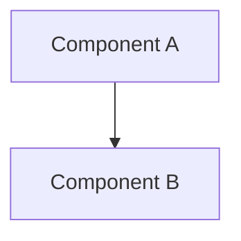

# 🚀 Przyszłe Usprawnienia OpenBrain ↔ Obsidian

## Podsumowanie wdrożonych funkcji ✅

| Funkcja | Status |
|---------|--------|
| Eksport notatek (write_note) | ✅ Wdrożone |
| Masowy eksport (export) | ✅ Wdrożone |
| Kolekcje (collection) | ✅ Wdrożone |
| Multi-vault support | ✅ Wdrożone |

---

## 🔮 Propozycje Rozszerzeń

### 1. Bi-directional Sync (Dwukierunkowa synchronizacja)

**Opis:** Synchronizacja zmian w obie strony - OpenBrain ↔ Obsidian.

**Scenariusze użycia:**
- Edytujesz notatkę w Obsidian → zmiany pojawiają się w OpenBrain
- Dodajesz tag w OpenBrain → aktualizuje się w Obsidian
- Tworzysz nową wersję w OpenBrain → aktualizacja w Obsidian

**Wyzwania techniczne:**
```
Problem: Conflict resolution (co gdy zmiany w obu miejscach?)
Rozwiązanie: 
  - Timestamp-based (ostatnia zmiana wygrywa)
  - Domain-based (corporate = OpenBrain master, personal = Obsidian master)
  - Manual merge (flaga "needs review")
```

**Architektura:**
```python
class ObsidianSyncEngine:
    async def sync_bidirectional(self, vault: str, since: datetime):
        # 1. Pobierz zmiany z Obsidian (mtime > since)
        obsidian_changes = await self.get_obsidian_changes(vault, since)
        
        # 2. Pobierz zmiany z OpenBrain (updated_at > since)
        openbrain_changes = await self.get_openbrain_changes(since)
        
        # 3. Wykryj konflikty
        conflicts = self.detect_conflicts(obsidian_changes, openbrain_changes)
        
        # 4. Rozwiąż konflikty
        for conflict in conflicts:
            resolution = await self.resolve_conflict(conflict)
            
        # 5. Zastosuj zmiany
        await self.apply_sync_changes(resolutions)
```

**Priorytet:** HIGH - Kluczowa funkcja dla produktywności
**Szacowany nakład:** 2-3 tygodnie

---

### 2. Auto-linking (Automatyczne linki wiki [[...]])

**Opis:** Automatyczne wykrywanie i tworzenie linków między powiązanymi memoriami.

**Scenariusze użycia:**
- Notatka o "Auth0" automatycznie linkuje do "Authentication Architecture"
- Wzmianka o "JWT" tworzy link do notatki o tokenach
- Relacje w OpenBrain (relations) stają się linkami w Obsidian

**Implementacja:**
```python
def generate_auto_links(content: str, all_memories: list[Memory]) -> str:
    """
    Dodaje linki wiki do treści notatki.
    """
    links_added = []
    
    for memory in all_memories:
        # Sprawdź czy tytuł lub aliasy występują w treści
        if memory.title and memory.title in content:
            # Zamień pierwsze wystąpienie na link
            wiki_link = f"[[{memory.title}]]"
            content = content.replace(memory.title, wiki_link, 1)
            links_added.append(memory.title)
    
    return content

# Przykład:
# Wejście:  "We use PostgreSQL for database storage."
# Wyjście: "We use [[PostgreSQL]] for [[database storage]]."
```

**Rozszerzenie - Graph View:**
```python
def generate_graph_data(memories: list[Memory]) -> dict:
    """
    Generuje dane dla Obsidian Graph View.
    """
    nodes = []
    edges = []
    
    for memory in memories:
        nodes.append({
            "id": memory.id,
            "label": memory.title,
            "group": memory.entity_type,
        })
        
        for relation in memory.relations:
            edges.append({
                "source": memory.id,
                "target": relation["target_id"],
                "label": relation["type"],
            })
    
    return {"nodes": nodes, "edges": edges}
```

**Priorytet:** MEDIUM - Znacząco poprawia nawigację
**Szacowany nakład:** 1 tydzień

---

### 3. Templates (Szablony notatek)

**Opis:** Własne szablony formatowania notatek dla różnych typów memorii.

**Scenariusze użycia:**
- Szablon "Decision" z sekcjami: Context, Decision, Consequences
- Szablon "Meeting" z: Attendees, Agenda, Action Items
- Szablon "Architecture" z: Diagram, Components, Trade-offs

**Implementacja:**
```python
# Predefiniowane szablony
TEMPLATES = {
    "decision": """# {title}

## Status
{status}

## Context
{context}

## Decision
{content}

## Consequences
### Positive
- 

### Negative
- 

## Metadata
- Date: {created_at}
- Owner: {owner}
- Domain: {domain}
""",

    "meeting": """# {title}

**Date:** {created_at}
**Attendees:** {custom_fields.attendees}

## Agenda
{content}

## Discussion Notes

## Action Items
- [ ] 

## Next Meeting

""",

    "architecture": """# {title}

## Overview
{content}

## Diagram


## Components
- 

## Trade-offs
| Option | Pros | Cons |
|--------|------|------|
| | | |

## Decision
{decision_rationale}
""",
}

# Użycie w eksporcie:
async def export_with_template(memory: Memory, template_name: str):
    template = TEMPLATES.get(template_name, TEMPLATES["default"])
    content = template.format(
        title=memory.title,
        content=memory.content,
        created_at=memory.created_at,
        owner=memory.owner,
        domain=memory.domain,
        status=memory.status,
        custom_fields=memory.custom_fields,
    )
    return content
```

**Rozszerzenie - Custom Templates:**
```yaml
# .openbrain/templates/my_template.md
---
name: "My Custom Template"
entity_types: ["Decision", "Architecture"]
domains: ["build", "corporate"]
---

# {{title}}

{{content}}

## My Custom Section
- Created by: {{owner}}
- Tags: {{tags}}

## Related
{{#relations}}
- [[{{target_title}}]] ({{relation_type}})
{{/relations}}
```

**Priorytet:** MEDIUM - Zwiększa spójność dokumentacji
**Szacowany nakład:** 1-2 tygodnie

---

### 4. Daily Notes (Dzienne notatki)

**Opis:** Automatyczne generowanie dziennych notatek z aktywności OpenBrain.

**Scenariusze użycia:**
- "Co dzisiaj dodałem do OpenBrain?"
- Podsumowanie codziennych decyzji
- Lista przeczytanych/uporządkowanych memorii

**Implementacja:**
```python
async def generate_daily_note(date: datetime, vault: str) -> ObsidianNote:
    """
    Generuje notatkę dzienną z aktywności OpenBrain.
    """
    
    # Pobierz aktywność z danego dnia
    activities = await get_daily_activity(date)
    
    content = f"""# Daily Note: {date.strftime('%Y-%m-%d %A')}

## OpenBrain Activity Summary

### New Memories ({len(activities['created'])})
{{#activities.created}}
- [[{{title}}]] — {{entity_type}} ({{domain}})
{{/activities.created}}

### Updated Memories ({len(activities['updated'])})
{{#activities.updated}}
- [[{{title}}]] — updated at {{updated_at}}
{{/activities.updated}}

### Decisions Made ({len(activities['decisions'])})
{{#activities.decisions}}
- **{{title}}**: {{summary}}
{{/activities.decisions}}

### Search History
{{#activities.searches}}
- `{{query}}` ({{results_count}} results)
{{/activities.searches}}

## Reflection

### What did I learn today?

### What needs follow-up?

---
*Generated by OpenBrain at {datetime.now().isoformat()}*
"""
    
    # Zapisz do Obsidian
    path = f"00 Inbox/Daily Notes/{date.strftime('%Y-%m-%d')}.md"
    
    return await adapter.write_note(
        vault=vault,
        path=path,
        content=content,
        frontmatter={
            "date": date.strftime('%Y-%m-%d'),
            "tags": ["daily-note", "openbrain"],
            "activity_count": len(activities['created']) + len(activities['updated']),
        },
    )

# Automatyczne generowanie o północy (cron/job scheduler)
async def scheduled_daily_note_generation():
    yesterday = datetime.now() - timedelta(days=1)
    await generate_daily_note(yesterday, vault="Memory")
```

**Priorytet:** LOW - Nice-to-have, ale nie krytyczne
**Szacowany nakład:** 3-5 dni

---

## 📊 Porównanie Priorytetów

| Funkcja | Priorytet | Nakład | Wpływ | Trudność |
|---------|-----------|--------|-------|----------|
| Bi-directional Sync | 🔴 HIGH | 2-3 tyg | Bardzo wysoki | Wysoka |
| Auto-linking | 🟡 MEDIUM | 1 tydz | Wysoki | Średnia |
| Templates | 🟡 MEDIUM | 1-2 tyg | Średni | Średnia |
| Daily Notes | 🟢 LOW | 3-5 dni | Średni | Niska |

---

## 🎯 Rekomendacja Roadmapy

### Q2 2026 (Kolejne 3 miesiące)
1. **Bi-directional Sync** - Najwyższa wartość dla użytkowników
2. **Conflict Resolution UI** - Do rozwiązywania konfliktów

### Q3 2026
3. **Auto-linking** - Poprawia nawigację
4. **Templates** - Spójność dokumentacji

### Q4 2026
5. **Daily Notes** - Automatyzacja
6. **Advanced Graph View** - Wizualizacja relacji

---

## 💡 Dodatkowe Pomysły

### Smart Suggestions
```python
# Podczas pisania w Obsidian, sugeruj powiązane memorie
async def suggest_related_memories(content: str) -> list[Memory]:
    embedding = await get_embedding(content)
    related = await search_similar(embedding, top_k=5)
    return related
```

### Voice-to-OpenBrain
- Dyktuj notatkę w Obsidian → AI ekstrahuje strukturę → Zapis do OpenBrain

### Plugin Obsidian
- Native Obsidian plugin zamiast przez filesystem
- Real-time sync przez WebSocket
- Custom UI w Obsidian

### Backlinks Index
- Automatyczne generowanie "Backlinks" dla każdej notatki
```markdown
## Backlinks
- [[Note A]] links here
- [[Note B]] mentions this
```

---

## Podsumowanie

Obecna implementacja (Sprint 1-4) daje solidne podstawy do eksportu. 

**Najważniejsze usprawnienie: Bi-directional Sync** - to game-changer, który zamieni OpenBrain i Obsidian w zintegrowany ekosystem wiedzy.

Czy chcesz, żebym zaczął implementować któreś z tych rozszerzeń?
